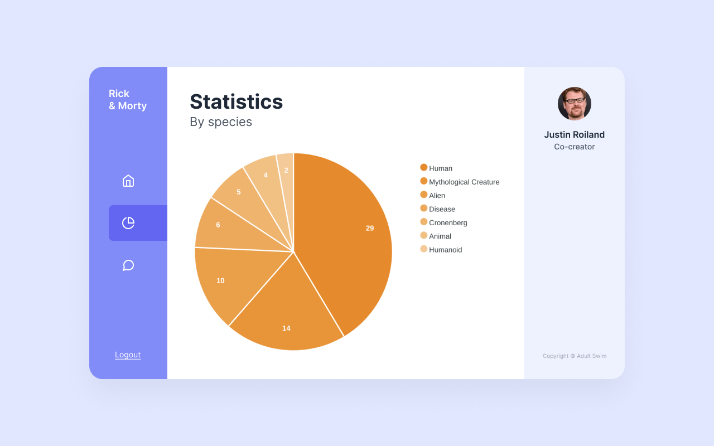

# Rick and Morty dashboard

## Introduction

 The primary goal of this exercise is to assess your ability to write well defined HTML, CSS and JavaScript using the latest patterns and technologies. There are no hard rules or tricky questions.

**We hope you have fun.**

## Brief



Recreate the above design, using the existing [pie chart component](src/components/PieChart.vue) and [provided assets](src/assets). You can use the [episodes](public/data/episodes.json) file to retrieve and transform the data appropriate for this chart. It shows the distribution of the species of all the unique characters in all the episodes. The data is based on the [Rick and Morty API](https://rickandmortyapi.com). The dashboard doesn't have to be responsive or interactive. For example, things like the "Logout" link don't have to work.

**Bonus:** try to get rid of the shadows behind the numbers on the chart.

## The deliverable

A zip of this repository.

## Setting up the project

```
npm install
```

### Start the local development server

```
npm run serve
```
